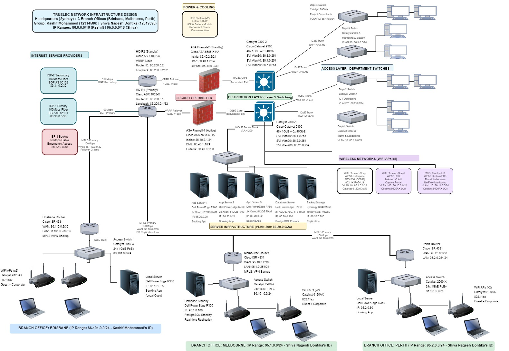
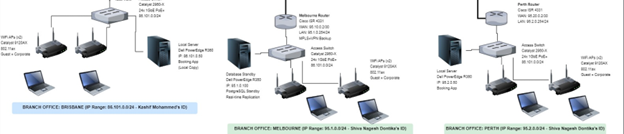

# Network Design
This section gives the detailed network design.

[Assumptions](#assumptions) | [Network Design Diagrams and Justifications](#network-design-diagrams-and-justifications) | [WiFi Design](#wifi-design) | [Address Allocations](#address-allocations) | [Recommended Hardware](#recommended-hardware) | [Plan](./plan.md) | [Cloud Services](./cloud.md) | [Security](./security.md) | [Ethics](./ethics.md) | [Reflection](./reflection.md) | [Return to index](./README.md)

## Assumptions

Truelec contracting business is operating from last 20 years and via its strategic growth program, the organization has planned to undertaken industrial projects and, in this concern, the robust network is required. The following given are some assumptions that have been made for network design related decisions.

- For headquarters, it is assumed that it will be located across Sydney, Australia. This major metropolitan city will be suitable for hosting the central administration, ICT infrastructure and setting up data center.
- The branch office locations primarily include Brisbane, Melbourne and Perth for carrying out business operations.
- There will be approximately 70 staff members assumed at headquarters while 20 staff members at each branch office.

---

## Network Design Diagrams and Justifications

For the Truelec organization, there is a need for designing a new network design which consists of headquarters in Sydney and three branches’ offices in Brisbane, Melbourne and Perth. All of these branches are interconnected via the MPLS WAN links and the design lays emphasis on the higher availability, redundancy, security and scalability. The following given is the logical network design that have been created in association with Truelec organization’s operational and strategic requirements.

---
### Design Justification

The given network design is primarily based on the hierarchal network architecture that consists of three layers such as core layer, distribution layer and host-access layer.

- **Core Layer:**  
  Under the core layer, the Cisco ASR 1002-X routers are used for connectivity and dual internet service providers are used for internet redundancy. The connections to these ISPs have been done via separate links and each ISP uses the dedicated /30 subnet such as 86.30.0.0/30 and 86.31.0.0/30. In addition to this, the MPLS is connecting to the headquarter to all the branch offices.

- **Security Perimeter:**  
  Despite the core layer, the Cisco ASA 5555-X firewalls have also been used on the network in the Active/standby mode. Following this device, all the internet and WAN traffic is passing through this device for stateful inspection, network address translation and VPN termination. This helps in improving policy consistency and protects internal network from severe cyber-attacks.

- **Distribution Layer:**  
  The middle layer is distribution layer where the Cisco Catalyst 9300 Layer-3 switches are primarily used. These switches are performing the inter-subnet routing for all departmental networks, works by routing the traffic between user subnets, server subnet and even WAN and lastly, acting as the aggregation points for the access switches.

- **Host Access Layer:**  
  The last layer is host access layer that connects Cisco Catalyst 2960-access switches for connecting each department with access switch, wired end-user devices and wireless access points for wireless connectivity.

---

## WiFi Design

Under the logical network design, the Wi-Fi design can also be seen where wireless connectivity is provided in order to support staff members, guests, and IoT/security devices at the HQ and branch offices. The wireless traffic is also segregated into dedicated sub-networks so as to improve security, manageability and performance.

## Address Allocations

### Headquarters: Sydney (86.0.0.0/16 - Kashif's ID)

| Department/System         | IP Range        | Subnet Mask |
|---------------------------|-----------------|-------------|
| Management & Leadership   | 86.1.0.0/24     | /24 |
| ICT & Network Operations  | 86.2.0.0/24     | /24 |
| Marketing & Business Dev  | 86.3.0.0/24     | /24 |
| Project Consultants       | 86.4.0.0/24     | /24 |
| Administrative Staff      | 86.5.0.0/24     | /24 |
| Guest WiFi Network        | 86.10.0.0/24    | /24 |
| IoT & Security            | 86.11.0.0/24    | /24 |
| Server Infrastructure     | 86.20.0.0/24    | /24 |
| ISP-1 Primary Link        | 86.30.0.0/30    | /30 |
| ISP-2 Secondary Link      | 86.31.0.0/30    | /30 |

### HQ Server IP Addresses (86.20.0.0/24)

- App Server 1: 86.20.0.20  
- App Server 2: 86.20.0.21  
- App Server 3: 86.20.0.22  
- Database Server: 86.20.0.100  
- Backup Storage: 86.20.0.200  

---

### Branch Brisbane (86.101.0.0/24 - Kashif's ID)

| System           | IP Address/Range | Details |
|------------------|------------------|---------|
| Staff Network    | 86.101.0.0/24    | 20 employees |
| Local Server     | 86.101.0.50      | Dell PowerEdge R360 - Booking App |
| WAN Link to HQ   | 86.110.0.0/30    | MPLS Primary Circuit |
| WAN IP Brisbane | 86.110.0.2/30    | ISR 4331 Router Interface |
| WAN IP HQ       | 86.110.0.1/30    | ASR 1002 Router Interface |

---

### Branch Melbourne (95.1.0.0/24 - Shiva's ID)

| System           | IP Address/Range | Details |
|------------------|------------------|---------|
| Staff Network    | 95.1.0.0/24      | 20 employees |
| Database Standby | 95.1.0.100       | Dell PowerEdge R360 - PostgreSQL Standby |
| WAN Link to HQ   | 95.10.0.0/30     | MPLS Primary Circuit |
| WAN IP Melbourne| 95.10.0.2/30     | ISR 4331 Router Interface |
| WAN IP HQ       | 95.10.0.1/30     | ASR 1002 Router Interface |

---

### Branch Perth (95.2.0.0/24 - Shiva's ID)

| System         | IP Address/Range | Details |
|----------------|------------------|---------|
| Staff Network  | 95.2.0.0/24      | 20 employees |
| Local Server   | 95.2.0.50        | Dell PowerEdge R360 - Booking App |
| WAN Link to HQ | 95.20.0.0/30     | MPLS Primary Circuit |
| WAN IP Perth   | 95.20.0.2/30     | ISR 4331 Router Interface |
| WAN IP HQ     | 95.20.0.1/30     | ASR 1002 Router Interface |

The table given below is for the wireless networks (SSIDs) and their respective subnet details.

| SSID Name     | Subnet                                         | Users                   | Purpose               |
|---------------|------------------------------------------------|-------------------------|-----------------------|
| Truelec-Corp  | Department subnets (86.1.0.0/24 – 86.5.0.0/24) | Staff                   | Corporate access      |
| Truelec-Guest | 86.10.0.0/24                                   | Visitors                | Internet-only access  |
| Truelec-IoT   | 86.11.0.0/24                                   | CCTV, RFID, and sensors | Security systems      |

---

## Recommended Hardware

The table given below provides the list of recommended hardware with respect to minimum level of specifications required, cost in AUD and links to the device.

| Item Type     | Manufacturer | Model            | Key Specifications                     | Qty | Approx. Cost (AUD)        | Link |
|--------------|--------------|------------------|----------------------------------------|-----|---------------------------|------|
| Core Router  | Cisco        | ASR 1002-X       | 10 Gbps throughput, dual PSU           | 1   | $25,000                   | https://www.cisco.com/c/en/us/products/collateral/routers/asr-1000-series-aggregation-services-routers/datasheet-c78-731632.html |
| Branch Router| Cisco        | ISR 4331         | MPLS, 1–10 Gbps                        | 3   | $1,595.18 / device        | https://www.router-switch.com/cisco-isr4331-k9-p-16544.html |
| Firewall     | Cisco        | ASA 5555-X       | Stateful FW, VPN                       | 2   | $11,169.22 / device       | https://www.router-switch.com/asa5555-k9-p-4622.html |
| Core Switch  | Cisco        | Catalyst 9300    | 48 ports, Layer 3, 10G uplinks          | 2   | A$4,989.04 / device       | https://www.router-switch.com/cisco-catalyst-9300-switches-price.html |
| Access Switch| Cisco        | Catalyst 2960-X  | 24–48 ports, 1 Gbps, PoE               | 6   | A$1,200 / device          | https://www.router-switch.com/ws-c2960x-48ts-ll-p-5263.html |
| Wireless AP  | Cisco        | Catalyst 9120AX  | WiFi 6, WPA3                           | 10  | A$780 / device            | https://www.router-switch.com/media/upload/product-pdf/cisco-catalyst-9120ax-series-access-points-datasheet.pdf |
| Server       | Dell         | PowerEdge R360   | Xeon CPU, ECC RAM, RAID                | 6   | A$3,932.72 / device       | https://www.dell.com/en-us/shop/ipovw/poweredge-r360 |
| UPS          | APC          | Smart-UPS 3000VA | Power protection                       | 2   | A$2,816.36 / device       | https://upssolutions.com.au/products/apc-smart-ups-c-3000va-2u-rack-mountable-lcd-230v?srsltid=AfmBOoqaNV4WhRZkyR0HQgWJLNr09QxGxLpziFEUSl2lSipU1e3B5Z6U |

---
